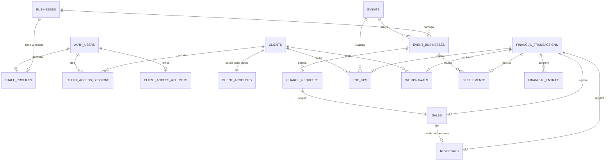

# Modelo de datos físico

Contrato de esquema aprobado en la Tarea 1.3 e implementado de forma incremental en las Tareas 1.4 y 1.5. Este documento refleja las tablas, tipos, restricciones, índices, transacciones, autenticación y RLS que ya están versionados y aplicados al proyecto autorizado de Supabase.

## Decisiones de dominio incorporadas

- Los teléfonos se almacenan en E.164, con `+52` como prefijo predeterminado de captura y soporte para otros países.
- El correo del cliente es opcional y, cuando existe, único sin distinguir mayúsculas.
- Todos los instantes se guardan como `timestamptz` y se presentan en `America/Mexico_City`.
- El dinero se guarda como centavos enteros. Cada recarga, compra, retiro y liquidación debe estar entre `5000` y `100000` centavos, inclusive; las reversiones heredan exactamente el importe de la venta.
- El límite de $1,000 MXN aplica a cada operación, no al saldo acumulado.
- Toda recarga exige que el administrador seleccione expresamente un evento existente; nunca se infiere uno.
- Una reversión posterior a una liquidación puede dejar negativo el saldo negocio–evento. Las ventas siguientes amortizan esa deuda antes de producir saldo liquidable.

El mínimo de $50 MXN implica que un remanente positivo inferior a esa cantidad no puede retirarse o liquidarse hasta alcanzar el mínimo con operaciones posteriores. No se crea una excepción silenciosa.

## Convenciones físicas

| Concepto        | Convención                                                                                          |
| --------------- | --------------------------------------------------------------------------------------------------- |
| Esquemas        | `cashless` para tablas internas y `api` para la superficie explícitamente expuesta al Data API      |
| Identificadores | `bigint generated always as identity` internos; UUID aleatorio separado para URLs, QR y referencias |
| Nombres SQL     | Inglés, minúsculas y `snake_case`                                                                   |
| Dinero          | `bigint` en centavos; nunca `money`, `real`, `double precision` ni valores decimales del navegador  |
| Instantes       | `timestamptz`, generados por la base de datos                                                       |
| Fechas locales  | Conversión a `America/Mexico_City` únicamente en presentación y reportes                            |
| Borrado         | `restrict` en datos auditables; estado inactivo o movimiento compensatorio en vez de borrado        |
| Auditoría       | `created_at`, actor autenticado, referencia pública e idempotencia cuando aplique                   |
| Datos demo      | `demo_batch_id` identifica el lote; limpiar significa archivarlo y excluirlo, no borrar movimientos |

`public` no contendrá tablas operativas. El proyecto expondrá únicamente `api` y aplicará `GRANT` explícitos; no dependerá de los privilegios automáticos de Supabase.

Las vistas y funciones de `api` serializarán importes y saldos como cadenas decimales de centavos. El frontend los convertirá a `bigint`; no pasarán por `number` de JavaScript.

## Relaciones

## Catálogo de tablas

Todas las claves foráneas usan `on delete restrict` salvo que se indique lo contrario. Cada clave foránea tendrá un índice, aunque no aparezca repetido en todas las filas del catálogo.

### Identidad, participantes y eventos

| Tabla                             | Columnas principales                                                                                                                                                                               | Restricciones esenciales                                                                                                                           |
| --------------------------------- | -------------------------------------------------------------------------------------------------------------------------------------------------------------------------------------------------- | -------------------------------------------------------------------------------------------------------------------------------------------------- |
| `cashless.demo_batches`           | `id uuid`, `slug text`, `status text`, `created_at timestamptz`, `archived_at timestamptz`                                                                                                         | PK `id`; `slug` única; estado `active` o `archived`; `archived_at` presente solo al archivar                                                       |
| `cashless.businesses`             | `id bigint`, `public_id uuid`, `name text`, `email text`, `is_active boolean`, `demo_batch_id uuid`, `created_by uuid`, `created_at timestamptz`                                                   | PK `id`; `public_id` y correo normalizado únicos; nombre no vacío                                                                                  |
| `cashless.staff_profiles`         | `auth_user_id uuid`, `role text`, `business_id bigint null`, `display_name text`, `is_active boolean`, `created_at timestamptz`                                                                    | PK/FK a `auth.users`; rol `admin` o `seller`; administrador sin negocio, vendedor con negocio; un administrador y un vendedor por negocio          |
| `cashless.clients`                | `id bigint`, `public_id uuid`, `full_name text`, `access_name text`, `phone_e164 text`, `email text null`, `is_active boolean`, `demo_batch_id uuid`, `created_by uuid`, `created_at timestamptz`  | PK `id`; `public_id` y teléfono únicos; correo normalizado único cuando no es nulo; E.164 `^\+[1-9][0-9]{7,14}$`; nombres normalizados y no vacíos |
| `cashless.client_accounts`        | `client_id bigint`, `balance_cents bigint`, `balance_version bigint`, `updated_at timestamptz`                                                                                                     | PK/FK `client_id`; saldo `>= 0`; versión `>= 0`; solo funciones financieras pueden actualizar                                                      |
| `cashless.client_access_sessions` | `auth_user_id uuid`, `client_id bigint`, `authenticated_at timestamptz`, `expires_at timestamptz`, `revoked_at timestamptz null`, `created_at timestamptz`                                         | PK/FK `auth_user_id`; `expires_at = authenticated_at + 8 hours`; sesión válida únicamente si no está revocada y no venció                          |
| `cashless.client_access_attempts` | `auth_user_id uuid`, `window_started_at timestamptz`, `attempt_count smallint`, `last_attempt_at timestamptz`, `blocked_until timestamptz null`                                                    | PK/FK a `auth.users` con borrado en cascada; máximo cinco intentos por ventana; bloqueo de quince minutos; sin privilegios ni políticas directas   |
| `cashless.events`                 | `id bigint`, `public_id uuid`, `name text`, `starts_at timestamptz`, `ends_at timestamptz`, `timezone_name text`, `status text`, `demo_batch_id uuid`, `created_by uuid`, `created_at timestamptz` | PK `id`; `public_id` única; `ends_at > starts_at`; zona igual a `America/Mexico_City`; estado `active` o `closed`                                  |
| `cashless.event_businesses`       | `id bigint`, `public_id uuid`, `event_id bigint`, `business_id bigint`, `balance_cents bigint`, `balance_version bigint`, `is_active boolean`, `created_at timestamptz`                            | PK `id`; `public_id` única; pareja evento–negocio única; el saldo puede ser negativo solo por reversión posterior a liquidación; versión `>= 0`    |

Normalización de identidad:

- `phone_e164` llega normalizado desde la función de alta; la base vuelve a validar su forma.
- `email` se guarda como `lower(btrim(email))`. Un índice único parcial `where email is not null` permite varios nulos, pero no correos repetidos.
- `access_name` usa minúsculas, extremos recortados y espacios internos colapsados. Sirve para la limitación de acceso del MVP; `full_name` conserva la forma visible.
- No se usa `raw_user_meta_data` para autorizar. La fuente de roles es `staff_profiles` y la relación del cliente es `client_access_sessions`.
- El administrador inicial se reconoce únicamente al crear un usuario permanente con el correo normalizado `tisacorreo@gmail.com`; un trigger crea su perfil administrativo sin confiar en metadatos del navegador.
- La identidad anónima se determina con el claim firmado `is_anonymous`; una sesión permanente jamás puede reclamar acceso de cliente.

### Cobros y libro financiero

| Tabla                             | Columnas principales                                                                                                                                                                                                                                                               | Restricciones esenciales                                                                                                                                                                           |
| --------------------------------- | ---------------------------------------------------------------------------------------------------------------------------------------------------------------------------------------------------------------------------------------------------------------------------------- | -------------------------------------------------------------------------------------------------------------------------------------------------------------------------------------------------- |
| `cashless.charge_requests`        | `id bigint`, `public_token uuid`, `event_business_id bigint`, `amount_cents bigint`, `description text`, `status text`, `created_by uuid`, `idempotency_key uuid`, `created_at timestamptz`, `expires_at timestamptz`, `paid_at timestamptz null`, `cancelled_at timestamptz null` | Token único e impredecible; importe entre `5000` y `100000`; descripción de 1–200 caracteres; vence exactamente a cinco minutos; estados y marcas temporales coherentes; idempotencia por vendedor |
| `cashless.financial_transactions` | `id bigint`, `public_id uuid`, `transaction_type text`, `amount_cents bigint`, `event_id bigint null`, `actor_user_id uuid`, `idempotency_key uuid`, `request_payload jsonb`, `demo_batch_id uuid null`, `created_at timestamptz`                                                  | PK y referencia pública; idempotencia global única; tipo permitido; importe válido; evento obligatorio salvo retiro; fila inmutable                                                                |
| `cashless.financial_entries`      | `id bigint`, `transaction_id bigint`, `entry_no smallint`, `client_id bigint null`, `event_business_id bigint null`, `delta_cents bigint`, `balance_before_cents bigint`, `balance_after_cents bigint`, `created_at timestamptz`                                                   | Exactamente una cuenta destino; delta no cero; posterior = anterior + delta; cuenta cliente nunca negativa; una entrada por cuenta y transacción; fila inmutable                                   |
| `cashless.top_ups`                | `id bigint`, `public_id uuid`, `transaction_id bigint`, `client_id bigint`, `event_id bigint`, `admin_user_id uuid`                                                                                                                                                                | Transacción única tipo `top_up`; cliente y evento obligatorios; evento elegido expresamente, sin selección automática                                                                              |
| `cashless.sales`                  | `id bigint`, `public_id uuid`, `transaction_id bigint`, `charge_request_id bigint`, `client_id bigint`, `event_business_id bigint`, `confirmed_by uuid`                                                                                                                            | Una venta por cobro y por transacción; importe y participación iguales al cobro; fila inmutable                                                                                                    |
| `cashless.reversals`              | `id bigint`, `public_id uuid`, `transaction_id bigint`, `sale_id bigint`, `reason text`, `admin_user_id uuid`                                                                                                                                                                      | Una reversión total por venta; importe idéntico a la venta; motivo de 3–500 caracteres; fila inmutable                                                                                             |
| `cashless.withdrawals`            | `id bigint`, `public_id uuid`, `transaction_id bigint`, `client_id bigint`, `admin_user_id uuid`                                                                                                                                                                                   | Transacción única tipo `withdrawal`; no supera saldo disponible; fila inmutable                                                                                                                    |
| `cashless.settlements`            | `id bigint`, `public_id uuid`, `transaction_id bigint`, `event_business_id bigint`, `admin_user_id uuid`                                                                                                                                                                           | Transacción única tipo `settlement`; requiere saldo positivo suficiente; una deuda negativa no es liquidable                                                                                       |

`financial_transactions.transaction_type` admite `top_up`, `purchase`, `sale_reversal`, `withdrawal` y `settlement`. Una reversión no modifica la venta original y una expiración de QR no crea movimiento financiero.

## Forma obligatoria de los asientos

| Tipo            | Asientos exactos                                        | Suma interna                |
| --------------- | ------------------------------------------------------- | --------------------------- |
| `top_up`        | Cliente `+amount_cents`                                 | Entrada externa de efectivo |
| `purchase`      | Cliente `-amount_cents`; negocio–evento `+amount_cents` | Cero                        |
| `sale_reversal` | Cliente `+amount_cents`; negocio–evento `-amount_cents` | Cero                        |
| `withdrawal`    | Cliente `-amount_cents`                                 | Salida externa de efectivo  |
| `settlement`    | Negocio–evento `-amount_cents`                          | Salida externa de efectivo  |

Un trigger de restricción diferible deberá verificar al confirmar la transacción que el número, destino, signo e importe de los asientos coinciden con el tipo y con la fila operativa. Las funciones financieras insertarán cabecera, operación, asientos y saldos dentro de una sola transacción corta.

## Invariantes de base de datos

1. Ninguna cantidad monetaria usa punto flotante.
2. Los importes de operación están entre `5000` y `100000` centavos; no existe límite superior de saldo.
3. El saldo del cliente nunca es negativo.
4. El saldo negocio–evento puede cruzar a negativo únicamente durante `sale_reversal`; ventas futuras lo incrementan y liquidaciones exigen saldo positivo suficiente.
5. Una solicitud de cobro origina como máximo una venta; una venta origina como máximo una reversión.
6. `expires_at = created_at + interval '5 minutes'`. Una solicitud pendiente con tiempo agotado se trata como vencida aunque el estado materializado aún no haya sido actualizado.
7. Toda recarga tiene `event_id`; ningún trigger elige un evento implícitamente. El administrador puede seleccionar un evento activo o cerrado para conservar la atribución cuando no exista uno activo.
8. El evento de compra, reversión y liquidación deriva de `event_businesses`; no se recibe como dato independiente del navegador.
9. Las tablas `financial_transactions`, `financial_entries`, `top_ups`, `sales`, `reversals`, `withdrawals` y `settlements` rechazan `DELETE` y actualizaciones ordinarias.
10. Todo reintento con la misma clave idempotente y la misma carga devuelve el resultado existente. La misma clave con una carga diferente falla.
11. Entidades con historial financiero se desactivan, no se eliminan.
12. Archivar datos demo jamás elimina asientos; marca el lote y lo excluye de vistas operativas normales.

## Funciones transaccionales previstas

La migración implementará funciones con parámetros en centavos y referencias públicas. Ningún cliente web escribirá saldos, operaciones o asientos directamente.

| Función `api`           | Actor    | Validaciones y efecto atómico                                                                                                              |
| ----------------------- | -------- | ------------------------------------------------------------------------------------------------------------------------------------------ |
| `create_top_up`         | Admin    | Autoriza actor; valida cliente, evento, importe e idempotencia; bloquea cuenta cliente; crea operación/asiento y acredita saldo            |
| `create_charge_request` | Vendedor | Autoriza negocio y participación activa; valida importe/descripción; crea token de QR e intervalo exacto de cinco minutos                  |
| `get_charge_preview`    | Cliente  | Recibe token; devuelve solo negocio, evento, descripción, importe, vencimiento y saldo suficiente; no permite enumerar cobros              |
| `confirm_purchase`      | Cliente  | Autoriza sesión; bloquea cobro, cliente y participación; valida pendiente, vigencia y saldo; crea venta y dos asientos; marca cobro pagado |
| `reverse_sale`          | Admin    | Bloquea venta, cliente y participación; impide doble reversión; acredita cliente y debita negocio aun si el resultado queda negativo       |
| `create_withdrawal`     | Admin    | Bloquea cliente; valida importe y saldo; crea retiro/asiento y debita saldo                                                                |
| `create_settlement`     | Admin    | Bloquea participación; valida importe y saldo positivo suficiente; crea liquidación/asiento y debita saldo                                 |

Orden de bloqueo obligatorio:

1. Fila de intención u operación (`charge_requests` o `sales`) cuando corresponda.
2. `client_accounts`, si participa.
3. `event_businesses`, si participa.

Las funciones no harán llamadas HTTP, correo ni trabajo externo mientras mantengan bloqueos. Usarán un tiempo límite local y devolverán identificadores ya existentes en reintentos válidos.

Las funciones privilegiadas son `security definer` solo porque deben escribir tablas financieras sin otorgar escritura directa al navegador. Cada una tendrá `search_path = ''`, nombres totalmente calificados, comprobación inicial de `auth.uid()`, propietario sin login y con privilegios mínimos, `EXECUTE` revocado de `PUBLIC` y `anon`, y concesión individual a `authenticated`. Las funciones de lectura y vistas serán `security invoker` siempre que sea posible.

## Superficie de API y RLS

La aplicación usa una sesión de Supabase Auth para toda petición. Administrador y vendedor tienen usuario permanente. El cliente obtiene un usuario anónimo de Auth y una relación temporal en `client_access_sessions` después de presentar nombre y teléfono. La sesión dura exactamente ocho horas desde `authenticated_at`; volver a presentar las mismas credenciales durante ese intervalo devuelve el vencimiento original y nunca lo extiende.

El acceso limitado aplica dos barreras: cinco intentos por usuario anónimo en una ventana de quince minutos y el límite nativo de altas anónimas por IP de Supabase. La tabla de intentos tiene RLS habilitada, cero políticas y cero privilegios para roles de navegador; solamente `api.claim_client_access` puede operarla como función endurecida. CAPTCHA queda como endurecimiento previo a producción porque requiere elegir y configurar un proveedor y sus dominios.

| Recurso                      | Administrador                | Vendedor                               | Cliente con sesión activa                         | `anon`   |
| ---------------------------- | ---------------------------- | -------------------------------------- | ------------------------------------------------- | -------- |
| Clientes y cuenta            | Lee todos; muta mediante RPC | Sin acceso                             | Lee solo perfil seguro, saldo e historial propios | Ninguno  |
| Negocios y eventos           | Lee todos; muta mediante RPC | Lee su negocio y eventos asignados     | Lee solo datos mínimos incluidos en vistas/RPC    | Ninguno  |
| Solicitudes de cobro         | Lee todas                    | Crea por RPC y lee las propias         | Consulta una por token mediante RPC, sin listado  | Ninguno  |
| Ventas y reversiones         | Lee todas; revierte por RPC  | Lee únicamente las de su participación | Lee únicamente las propias                        | Ninguno  |
| Recargas y retiros           | Lee todas; crea por RPC      | Sin acceso                             | Lee únicamente las propias                        | Ninguno  |
| Liquidaciones                | Lee todas; crea por RPC      | Lee únicamente las de su participación | Sin acceso                                        | Ninguno  |
| Transacciones y asientos     | Lee todos                    | Lee asientos de sus participaciones    | Lee asientos de su cuenta                         | Ninguno  |
| Escritura financiera directa | Denegada                     | Denegada                               | Denegada                                          | Denegada |
| `DELETE` operativo           | Denegado                     | Denegado                               | Denegado                                          | Denegado |

RPC de identidad disponibles en la Tarea 1.5:

| Función `api`                               | Actor autorizado     | Contrato                                                                                                                                   |
| ------------------------------------------- | -------------------- | ------------------------------------------------------------------------------------------------------------------------------------------ |
| `get_current_access()`                      | `authenticated`      | Devuelve como máximo la identidad activa derivada por la base; no acepta un rol enviado por el frontend                                    |
| `claim_client_access(text, text)`           | Usuario Auth anónimo | Normaliza nombre, valida teléfono E.164, limita intentos y crea o recupera la sesión de ocho horas sin revelar cuál credencial fue errónea |
| `revoke_client_access()`                    | Cliente autenticado  | Marca la relación temporal como revocada antes de que el navegador elimine su sesión Auth local                                            |
| Trigger `bootstrap_admin_profile()` interno | `auth.users`         | Crea el único perfil administrativo solo para el correo permanente autorizado                                                              |

Controles obligatorios:

- RLS habilitada en todas las tablas, incluso dentro del esquema interno, como defensa en profundidad.
- `api` es el único esquema de aplicación expuesto. Contiene vistas `security_invoker` y funciones expresamente enumeradas.
- Los `GRANT` se declaran por vista, tabla interna requerida y firma de función; quedan prohibidos `GRANT ALL` y privilegios predeterminados amplios.
- Las políticas usan `TO authenticated`, `(select auth.uid())` y predicados de propiedad. `TO authenticated` por sí solo nunca constituye autorización.
- Columnas usadas por RLS —`auth_user_id`, `client_id`, `business_id` y `event_business_id`— siempre están indexadas.
- No se autoriza con `raw_user_meta_data`; tampoco se confía en un rol del frontend.
- Las vistas se crean con `security_invoker = true`.
- No existen políticas de inserción, actualización o borrado directo sobre el libro financiero para roles de navegador.
- El token QR nunca otorga acceso general: solo parametriza funciones de vista previa y confirmación.

## Índices mínimos

Además de PK y unicidad:

- Índices parciales únicos en `clients(email) where email is not null`, vendedor por negocio y administrador único.
- `client_access_sessions(client_id, expires_at)` y `staff_profiles(business_id)` para autorización.
- `events(status, starts_at)` y `event_businesses(event_id, is_active)` para operación de evento.
- `event_businesses(business_id, event_id)` además de la unicidad evento–negocio para consultas por vendedor.
- `charge_requests(event_business_id, status, created_at desc)` y parcial `(expires_at) where status = 'pending'`.
- `financial_transactions(event_id, created_at desc, id desc)` y `(transaction_type, created_at desc)` para administración y CSV.
- `financial_entries(client_id, transaction_id desc) where client_id is not null`.
- `financial_entries(event_business_id, transaction_id desc) where event_business_id is not null`.
- Índices en todas las claves foráneas de tablas operativas.

No se particionarán tablas durante el MVP. Se medirá antes de agregar índices de cobertura o particionamiento.

## Consultas y reportes

- Los historiales se paginan por cursor `(created_at, id)`, no con offsets crecientes.
- El saldo mostrado proviene de la proyección bloqueada; los reportes de auditoría pueden recomputarlo desde asientos.
- Las vistas administrativas unen operación, transacción y asientos, y convierten centavos a texto MXN solo al presentar o exportar.
- Los reportes convierten `created_at at time zone 'America/Mexico_City'`; nunca alteran el instante almacenado.
- Ventas por negocio calculan bruto, reversiones, liquidaciones, deuda y saldo por `event_business_id`.
- Los lotes demo archivados se excluyen de forma predeterminada, pero permanecen consultables por el administrador para auditoría.

## Pruebas de migración exigidas para la Tarea 1.4

1. Crear el esquema desde cero y volver a ejecutarlo mediante el flujo soportado de migraciones.
2. Comprobar cada `CHECK`, unicidad, FK, índice y restricción parcial con casos válidos e inválidos.
3. Probar límites exactos: 4999 rechazado, 5000 aceptado, 100000 aceptado y 100001 rechazado.
4. Confirmar que varias operaciones válidas pueden superar $1,000 MXN de saldo acumulado.
5. Ejecutar dos confirmaciones concurrentes del mismo QR y dos débitos concurrentes del mismo cliente.
6. Verificar reintento idempotente y rechazo de una clave reutilizada con carga diferente.
7. Revertir una venta liquidada y comprobar saldo negocio–evento negativo; después amortizarlo con ventas nuevas.
8. Probar RLS con `anon`, cliente A, cliente B, vendedor A, vendedor B y administrador.
9. Confirmar que vistas y funciones no filtran PII ni permiten enumerar tokens QR.
10. Ejecutar asesores de seguridad y rendimiento de Supabase y resolver hallazgos antes del commit.

## Pruebas de autenticación ejecutadas en la Tarea 1.5

1. Verificar estructura, RLS y privilegios de los tres RPC mediante nueve aserciones pgTAP.
2. Confirmar que credenciales válidas crean acceso y que el cliente solo ve su identidad activa.
3. Repetir las credenciales durante la sesión y comprobar que `session_expires_at` no cambia.
4. Revocar la sesión y comprobar en una sentencia posterior que la identidad deja de estar disponible.
5. Comprobar respuesta genérica para credenciales inválidas, bloqueo en el quinto intento y rechazo de usuarios permanentes.
6. Ejecutar la prueba funcional dentro de una transacción con `ROLLBACK`, sin conservar usuarios ni clientes de prueba.

## Fuentes técnicas verificadas

- [Seguridad del Data API de Supabase](https://supabase.com/docs/guides/api/securing-your-api): esquemas dedicados, `GRANT`, RLS y revisión de funciones privilegiadas.
- [Row Level Security de Supabase](https://supabase.com/docs/guides/database/postgres/row-level-security): políticas por rol, `auth.uid()`, vistas `security_invoker` e índices para RLS.
- [Funciones de base de datos de Supabase](https://supabase.com/docs/guides/database/functions): `security invoker` por defecto y endurecimiento obligatorio de `security definer`.
- [Cambio de exposición automática del Data API](https://supabase.com/changelog/45329-breaking-change-tables-not-exposed-to-data-and-graphql-api-automatically): las migraciones deben declarar privilegios explícitos.
- [Usuarios anónimos de Supabase Auth](https://supabase.com/docs/guides/auth/auth-anonymous): rol PostgreSQL `authenticated`, claim `is_anonymous`, límites por IP y recomendación de CAPTCHA.
- [Autenticación por contraseña](https://supabase.com/docs/guides/auth/passwords): acceso permanente del personal y recuperación por correo.
- [Restricciones de PostgreSQL](https://www.postgresql.org/docs/current/ddl-constraints.html) y [bloqueo explícito](https://www.postgresql.org/docs/current/explicit-locking.html): integridad y orden de bloqueos concurrentes.
